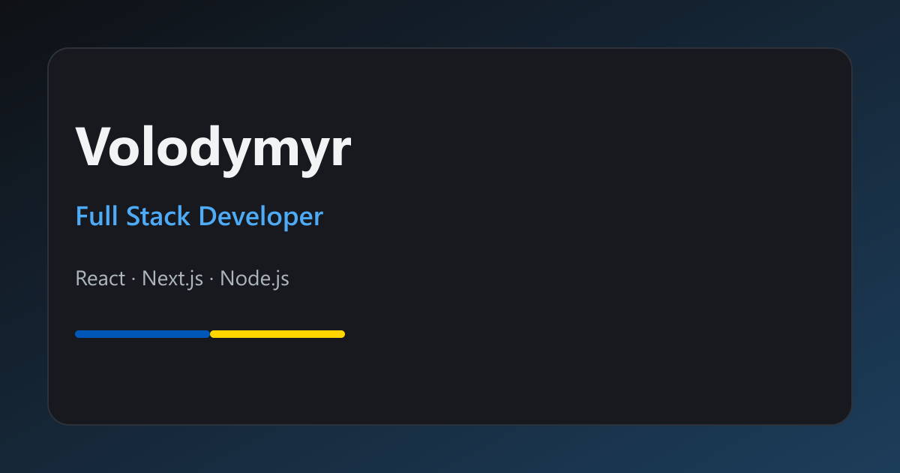
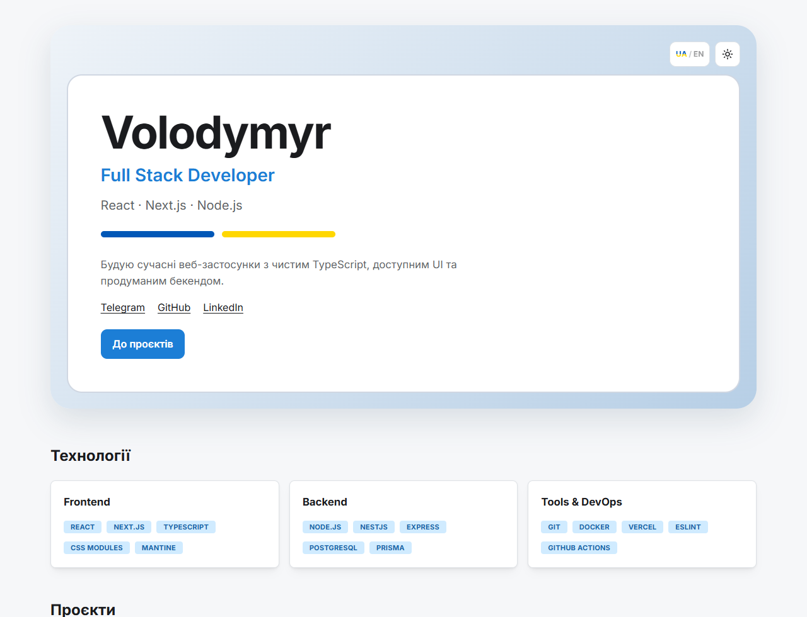
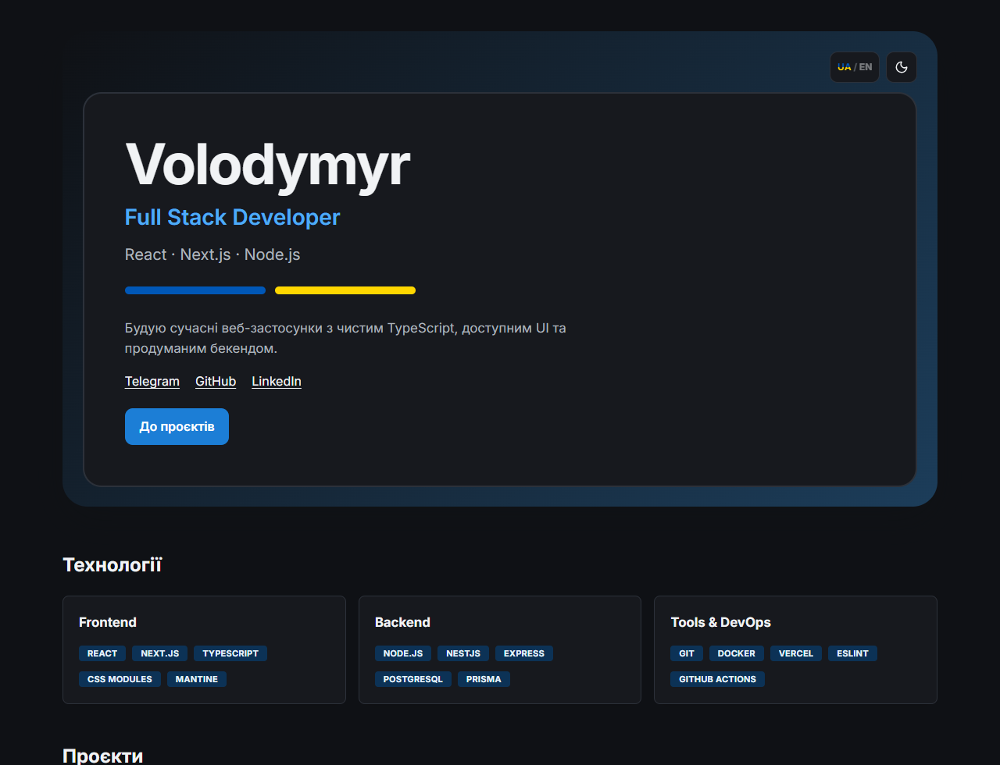
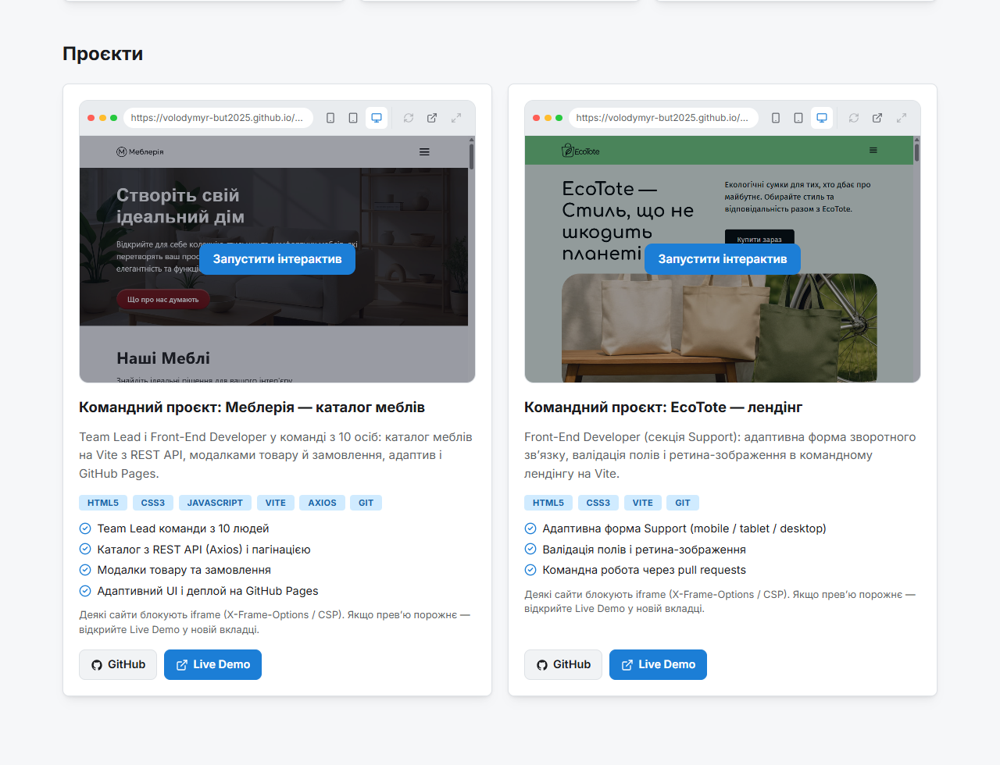
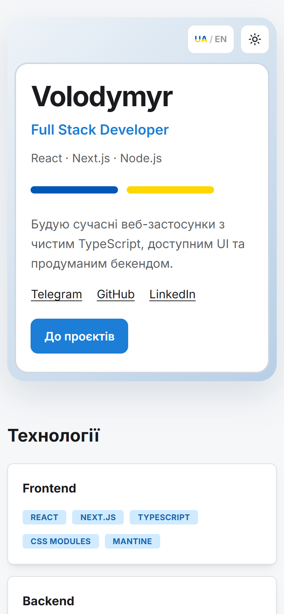

**English** | [Українська](README.uk.md)

# Volodymyr — Full Stack Developer

Personal portfolio on **Next.js 16**: hero, tech stack, and learning projects with interactive iframe previews.

**Live:** [https://portfolio-ve1w.vercel.app](https://portfolio-ve1w.vercel.app/)  
**GitHub:** [Volodymyr-But2025/portfolio](https://github.com/Volodymyr-But2025/portfolio)

<p align="center">
  
</p>

## Screenshots

<table>
  <tr>
    <td align="center">
      <strong>Light theme</strong><br>
      
    </td>
    <td align="center">
      <strong>Dark theme</strong><br>
      
    </td>
  </tr>
  <tr>
    <td align="center">
      <strong>Project cards</strong><br>
      
    </td>
    <td align="center">
      <strong>Mobile</strong><br>
      
    </td>
  </tr>
</table>

## What it does

- **UA / EN** — locale from the `portfolio-locale` cookie and `Accept-Language` (no separate URL per locale).
- **Light / dark theme** — Mantine `ColorSchemeScript`, respects system preference.
- **Interactive previews** — project poster, click-to-launch iframe, refresh, modal, phone / tablet / desktop presets.
- **Consistent cards** — GitHub (repository) and Live Demo; for Harmoniq, GitHub points to the monorepo.
- **Contacts** — Telegram, GitHub, LinkedIn.
- **Accessibility** — button labels, `focus-visible`, `rel="noopener noreferrer"` on external links.

If a site blocks embedding (`X-Frame-Options` / CSP), the preview may be empty — open Live Demo in a new tab.

## Projects

Data lives in `src/data/projects.ts`.

| Project | Role | Live | Code |
| --- | --- | --- | --- |
| [Harmoniq](https://harmoniq-azure.vercel.app) — article platform | Full-Stack Developer, team of 12 (Next.js, Express, MongoDB) | [Vercel](https://harmoniq-azure.vercel.app) | [monorepo](https://github.com/Volodymyr-But2025/harmoniq) |
| [Mebleriya](https://volodymyr-but2025.github.io/Mebleriya/) — furniture catalog | Team Lead & Front-End Developer, team of 10 (Vite, Axios, REST API) | [GitHub Pages](https://volodymyr-but2025.github.io/Mebleriya/) | [repository](https://github.com/Volodymyr-But2025/Mebleriya) |
| [Tattoo Calculator](https://tattoo-calculator-ashen.vercel.app/) — tattoo price estimator | Front-End Developer, personal PWA (React, Vite, Tailwind) | [Vercel](https://tattoo-calculator-ashen.vercel.app/) | [repository](https://github.com/Volodymyr-But2025/TattooCalculator) |
| [EcoTote](https://volodymyr-but2025.github.io/Team_junior/) — landing | Front-End Developer, Support section (Vite: form, validation, retina) | [GitHub Pages](https://volodymyr-but2025.github.io/Team_junior/) | [repository](https://github.com/Volodymyr-But2025/Team_junior) |

## Stack

| Layer | Technologies |
| --- | --- |
| UI | React 19, Next.js 16 (App Router), TypeScript, CSS Modules, Mantine |
| i18n | custom `uk` / `en` dictionaries, `portfolio-locale` cookie, middleware |
| Tests | Vitest, Testing Library, jsdom |
| Quality | ESLint (`eslint-config-next`) |
| Deploy | [Vercel](https://portfolio-ve1w.vercel.app/) (`master` → production) |

## Run

```bash
npm install
npm run dev
```

Open [http://localhost:3000](http://localhost:3000).

```bash
npm run lint      # ESLint
npm run test:run  # Vitest once
npm run build     # production build
```

## Structure

```
src/app/           # layout, home page, favicon / icon.svg, global styles
src/components/    # hero, tech stack, project cards, toggles
src/data/          # contacts, stack, projects
src/i18n/          # locales, dictionaries, Accept-Language
src/test/          # Vitest helpers
middleware.ts      # sets locale cookie
public/            # og.png and project posters
docs/screenshots/  # screenshots for README
```

## Contacts

- Telegram: [t.me/Volodymyr_Butenko_Y](https://t.me/Volodymyr_Butenko_Y)
- GitHub: [Volodymyr-But2025](https://github.com/Volodymyr-But2025)
- LinkedIn: [volodymyr-butenko-y](https://www.linkedin.com/in/volodymyr-butenko-y)
- Portfolio: [portfolio-ve1w.vercel.app](https://portfolio-ve1w.vercel.app/)
